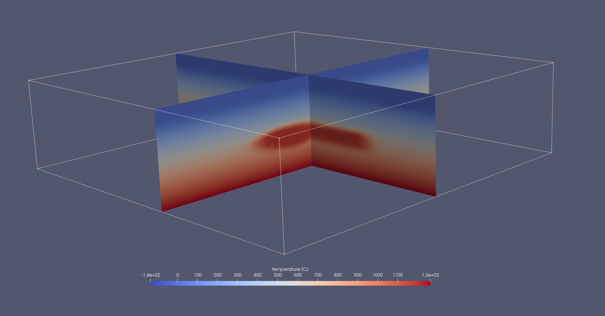

# 3.4 How to use a temperature input file

A temperature input file can be used to introduce a custom temperature field at the start of the simulation. The file can be created in Matlab as a 3D matrix for convenience. The matrix is expected to cover the entire model **(not more and not less)**. The size of the matrix does not matter but if you want to **assign a temperature to a certain body**, it is recommended to fit the **marker resolution**.

### Setting up the file with Matlab

```
%% Setup temperature
% get bounds of LaMEM box
x_box       = opt.setup.coord_x;
y_box       = opt.setup.coord_y;
z_box       = opt.setup.coord_z;

% fit marker distribution
nx  = length(opt.setup.marker_x);
ny  = length(opt.setup.marker_y);
nz  = length(opt.setup.marker_z);

% initialize matrix
T3D = zeros(nx,ny,nz);

% set up coordinate grid (for assigning specific temperatures based on coordinates)
dx      = (x_box(2)-x_box(1))/nx;
dy      = (y_box(2)-y_box(1))/ny; 
dz      = (z_box(2)-z_box(1))/nz;
x_vec   = (x_box(1)+dx/2:dx:x_box(2)-dx/2);
y_vec   = (y_box(1)+dy/2:dy:y_box(2)-dy/2);
z_vec   = (z_box(1)+dz/2:dz:z_box(2)-dz/2);
% DO NOT USE MESHGRID HERE!
[X,Y,Z] = ndgrid(x_vec,y_vec,z_vec);

%% setup linear Temperature profile starting at the surface
z_surf      = 3;
gradient    = 30;      % [K/km]
zeros(nz,1);
ind_surf    = find(z_vec < z_surf);
T_vec       = zeros(nz,1);
T_vec(ind_surf)     = (z_surf - z_vec(ind_surf)) * gradient;

for i = 1 : nz
    T3D(:,:,i) = T_vec(i);
end

%% assign Temperature to volume
vol     = Volumes.Magma;
T_vol   = 1180;

% run through all depths
for k = 1 : nz
    depth   = z_vec(k);
    Slices  = {};
    % find slices at that depth
    for s = 1 : length(vol.Polygons)
        if vol.Polygons{s}(1,3) <= depth + dz/10 && vol.Polygons{s}(1,3) >= depth - dz/10
            Slices = [Slices; vol.Polygons{s}];
        end
    end
    
    % if slices of the body exist at that depth
    if ~isempty(Slices)
        allInds = false(nx,ny);
        % add all markers that lie inside the body
        for s = 1 : length(Slices)
            inds = inpolygon(X(:,:,k),Y(:,:,k),Slices{s}(:,1),Slices{s}(:,2));
            allInds = allInds | inds;
        end
        % assign the markers a temperature
        T_Slice             = squeeze(T3D(:,:,k));
        T_Slice(allInds)    = T_vol; 
        T3D(:,:,k) = T_Slice;
    end
    
end

%% write binary to be read by LaMEM
%(Filename,[# of points in x-dir, # of points in y-dir, # of points in z-dir, Temp-Matrix in vector form])
petscBinaryWrite('T3D.dat',[nx;ny;nz;T3D(:)]);
```

### Loading file in LaMEM

In the LaMEM input file, set:
```	
temp_file	= ./T3D.dat
```
Options `init_temp` and `act_steady_temp` need to be disabled

```
init_temp       = 0
act_steady_temp = 0
```

